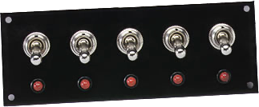

Flashback zurück nach Einführung in die Informatik, was ist ein Register?



# Arten von Registern

## Datenregister

Diese Register speichern Daten, der Unterschied zu normalem, linearen Speicher, ist, dass sie meistens um ein vielfaches schneller sind.

_(was ist linearer Speicher? Der ganz normale RAM, der über eine Adresse wie 0x123456 erreicht werden kann.)_


## Kontrollregister

Diese Register verändern, wenn sie geschrieben werden, das Verhalten der CPU oder eines anderen Teils des Microcontrollers.
Verwandt mit dem Kontrollregister sind Statusregister, welche gelesen werden können, um den Status eines Teils der Hardware abzufragen.


# Zugriffsarten auf Register

## CPU Register

Diese Register sind Teil der CPU und können über spezielle OpCodes gelesen/geschrieben werden.


## Memory Mapped Registers

Diese Register sind in den linearen Speicher "gemappt", und werden über Speicheradressen gelesen/geschrieben. Bei Zugriffen auf diese Speicherbereiche fängt eine spezielle Hardwareinheit am anderen Ende des Bus die Abfrage ab und leitet sie um, weg vom Speichercontroller hin zu der entsprechenden Hardwareeinheit.


# Beispiele

## 'X' aus EidI

In den Beispiel CPUs aus EidI gab es meistens ein Register X und OpCodes um X zu lesen/zu schreiben.
Das wäre ein Beispiel für ein CPU Datenregister.


## STM32-F4 RNG Einheit: 'RNG->SR' Register

Das ``RNG->SR`` Register ist ein Beispiel für ein Memory Mapped Statusregister. Das Bit ``RNG_SR_DRDY``signalisiert ob eine Zufallszahl bereit ist. Wenn ja, kann diese Zahl aus dem (ebenfalls memory mapped) Register ``RNG->DR``gelesen werden.


## STM32-F4 GPIO Einheit: 'GPIOx_MODER' Register

Im nächsten Kapitel wird GPIO detailierter behandelt, als ein Beispiel, über ``GPIOx_MODER`` kann konfiguriert werden ob der Pin als Input oder Output verwendet werden soll. ('x' ist die IO-Bank, z.B. B)

Ein weiteres GPIO Register ist das ``GPIOx_ODR`` Register. ODR steht (wahrscheinlich, ich rate hier nur) für Output Data Register. Nachdem das Register in ``MODER``als Output konfiguriert wurde, kann ich hier das Register auf ``high``oder ``low``setzen. 

# Setzen / Lesen einzelner Bits

Oft haben einzelne Bits in den Registern eigene Funktionen. Nimmt man als Beispiel das GPIO Register ``GPIOB_ODR``, dann steuert dieses den Output der kompletten IO Bank B.

So gut wie immer will ich aber nicht eine komplette IO Bank steuern, sondern einzelne Bits.

In diesem Fall muss ich mit Bitmasken arbeiten.

Als Beispiel, um Pin 7 der Bank B auf ``high``zu ziehen:

```c
GPIOB->ODR |= (1 << 7); 
```

Um den gleichen Pin auf ``low``zu setzen:

```c
GPIOB->ODR &= ~(1 << 7); 
```


# Syntax

In der C Syntax entspricht ``GPIOB->ODR`` dem Register ``GPIOB_ODR``.
``GPIOB`` ist die Basisadresse der IO Bank B, also wo die Register dieser Bank anfangen. ``ODR`` ist dann ein Offset der zu dieser Basisadresse dazugezählt wird.

