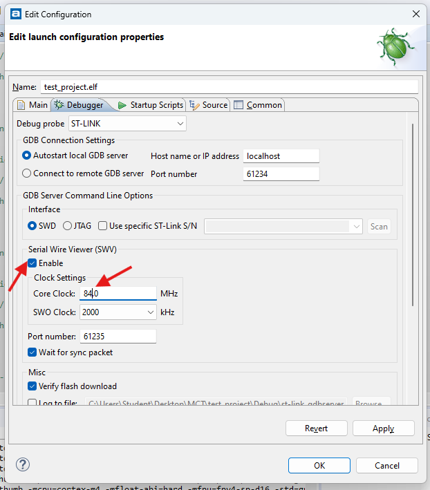
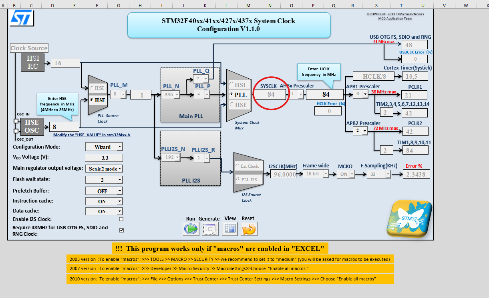
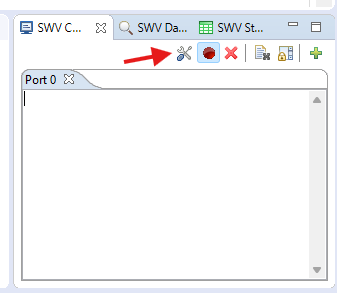
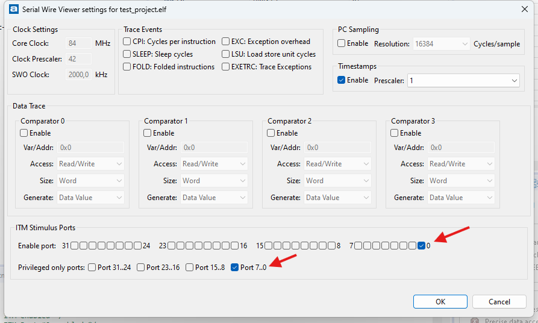
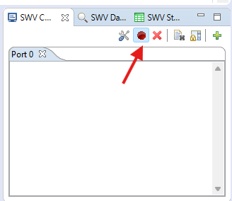

Der in das Dev Board integrierte ST-Link kann verwendet werden, um Text vom Microcontroller an die IDE zu schicken.

### Ayatollah Studio

Um die SWV Verbindung verwenden zu können, muss zuerst in den Debug-Einstellungen SWV Aktiviert und die richtige Frequenz eingetragen werden.

Eingetragen werden muss die Core Frequenz aus dem Excel Tool:






Nach dem das Programm gestartet wurde, muss der Port aktiviert werden (1x, das wird gespeichert):




Dann muss der Trace gestartet werden (JEDES MAL, wird nicht gespeichert)




### Cube IDE


Folgendes wurde in der STM32 Cube IDE getestet:

1 - [ST-Link updaten](./../setup-cube-ide/setup.md#st-link)

2 - Core Frequenz setzen

Die Core Frequenz, welche an anderer Stelle konfiguriert wurde, muss nun ebenfalls im Debug Menü eingetragen werden:

TODO


--------


### printf

``printf``kann umgeleitet werden, indem folgender Block in ``main.c``kopiert wird:

```c
int _write(int file, char *ptr, int len) {
    for (int i = 0; i < len; i++) {
        ITM_SendChar((*ptr++));
    }
    return len;
}
```

(in Cube IDE kann _write über main kopiert werden, in Ayatollah Studio MUSS _write in syscalls.c EDITIERT werden)

Allerdings verwendet printf intern einen Buffer und schreibt die Daten erst weiter wenn diese voll ist. Die Ausgabe wird also nur mit einiger Verzögerung angezeigt.

Um den Buffer sofort weiterzuschreiben kann ``fflush`` verwendet werden:

```c
#include <stdio.h>

printf("Hello :)");
fflush(stdout);
```


### Eigene Funktion

Es ist sinnvoller, direkt ``ITM_SendChar``aufzurufen, ohne den Umweg über printf.

Dafür können folgende Hilfsfunktionen verwendet werden:


```c

#include <stdarg.h>

void ITM_SendString(char* s) {
	while(*s) {
		ITM_SendChar(*s++);
	}
}

char buffer[2048]; // the size of buffer must be chosen so that it is bigger than any single string that will be formatted by 'ITM_SendStringFormat'
void ITM_SendStringFormat(const char *format, ...) {
    va_list va;
    va_start (va, format);
    vsprintf (buffer, format, va);
    va_end (va);

    ITM_SendString(buffer);
}
```

Nun können die beiden Funktionen verwendet werden um entweder direkt einen String auszugeben ohne Formatierung (``ITM_SendString("Hallo :)")``) oder mit Formatierung äquivalent printf (``ITM_SendStringFormat("%i + 1 = 6", 5)``).


### Alternativen

Die Verwendung der Debug Funktionalität (``ITM_SendChar``) ist nur möglich bei verbundenem Hardware Debugger. Auf dem Dev-Board ist ein ST-LINK integriert.

Ansonsten wird oft logging über den seriellen Port (UART) ausgegeben, und kann dann über einen Serial2USB Wandler am PC ausgelesen werden.


