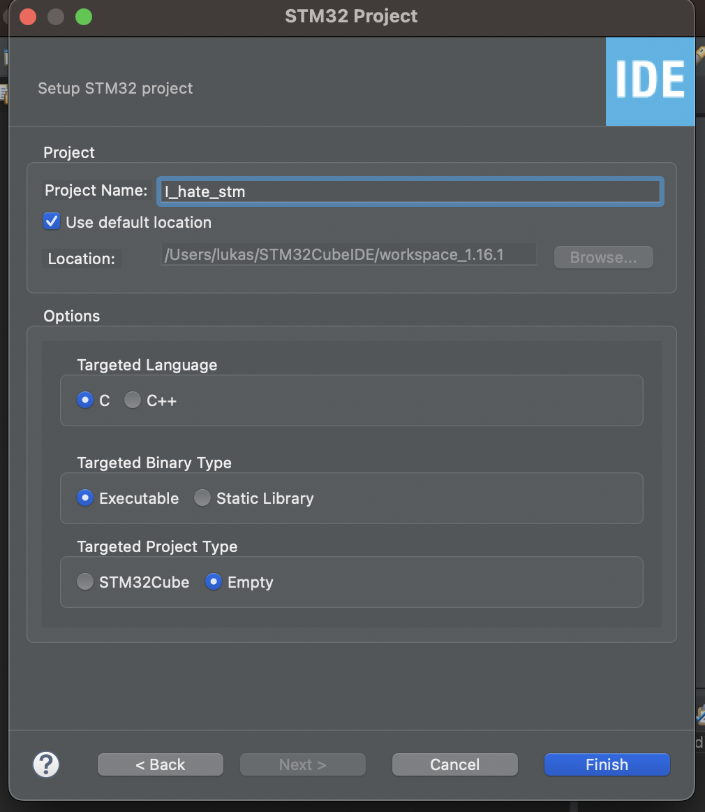

Wenn der Projecterstellungsassistent verwendet wird, dann wird der HAL (Hardware Abstraction Layer) referenziert. Dieser soll/darf bei uns aber nicht verwendet.

Deswegen ist es wahrscheinlich am einfachsten, ein leeres Projekt zu erstellen, und dann die Referenzen auf CMSIS hinzuzufügen.

## Projekt erstellen

 

 Oben links: "Board Selector", dann bei "Commercial Part Number" "STM32F407G-DISC1" auswählen, das Board unten rechts auswählen, und auf "Next" drücken.

 

 

 Hier bei "Targeted Project Type" ``empty``auswählen.

## CMSIS referenzieren

Anschließend das neue Projekt rechtsklicken, unten "Properties", dann "C/C++ General" -> Paths and Symbols.

Dort im Tab "Includes" die folgenden zwei Pfade hinzufügen. Benutzernamen ersetzen, eventuell Versionsnummer korrigieren.

Achtung: "Add to all Configurations" anhaken.

```
 /Users/<username>/STM32Cube/Repository/STM32Cube_FW_F4_V1.28.1/Drivers/CMSIS/Device/ST/STM32F4xx/Include
 /Users/<username>/STM32Cube/Repository/STM32Cube_FW_F4_V1.28.1/Drivers/CMSIS/Include
```


Anschließend kann in main.c der Header hinzugefügt werden

```c
#include "stm32f4xx.h"
```


## Peripheral Driver referenzieren

Im letzten Schritt aus der Installation wurden die Treiber für die Peripheriegeräte heruntergeladen. Diese müssen nun ebenfalls referenziert werden.

Dafür wie davor folgenden Ordner zu den Include Pfaden hinzufügen:

```
<dir>/STM32F4-Discovery_FW_V1.1.0/Libraries/STM32F4xx_StdPeriph_Driver/inc
```

Zusätzlich müssen einige .c Dateien kompiliert werden: \<todo\>
