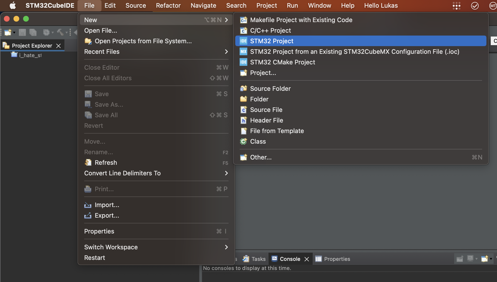
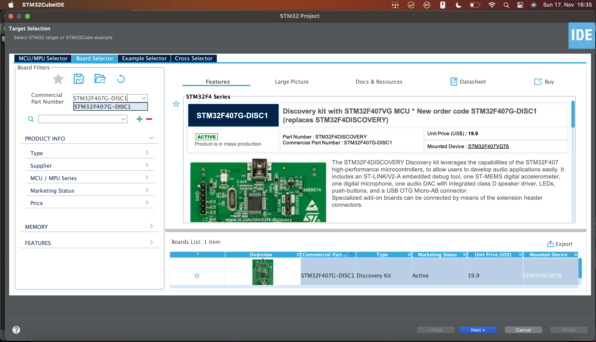

Für macOS gibt es nur die STM32 CubeIDE, nicht die Ayatollah IDE welche in der Uni verwendet wird.

## Download

https://www.st.com/en/development-tools/stm32cubeide.html#get-software

## Setup

 * Installieren

 * ST Account erstellen und Einloggen

 

 * Check For Target Selector Device Database Updates

 * Check for Embedded Software Packages Updates

 * Manage Embedded Software Packages

 

 * ST-Link auf Dev-Board updaten
   
   (ST-Link ist der auf dem Entwicklungsboard integrierte Programmer / Debugger)

   

   Dann Entwicklungsboard USB Trennen, RESET Button gedrückt halten und USB neu verbinden. Dann kann RESET losgelassen werden.

   Im Update Tool auf "Open in Update Mode" klicken, dann "Upgrade".

 * Neues Projekt erstellen

 

 Oben links: "Board Selector", dann bei "Commercial Part Number" "STM32F407G-DISC1" auswählen, das Board unten rechts auswählen, und auf "Next" drücken.

 

 

